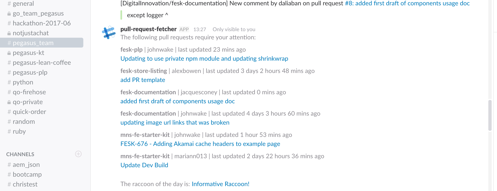
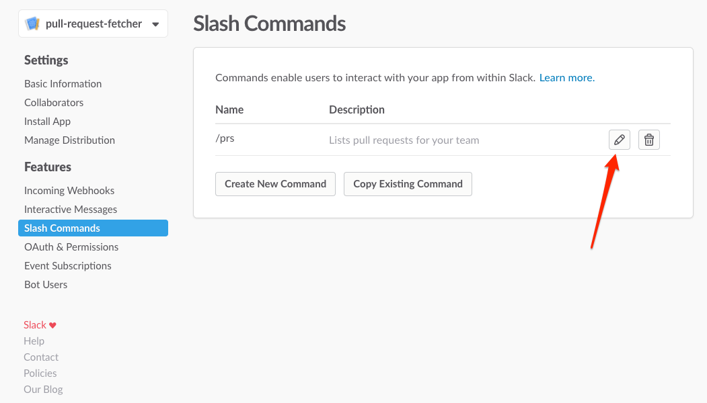

# pull-request-fetcher

## Description

This is a bot built using [botkit](https://github.com/howdyai/botkit) which acts as a slash-command for slack. The slash-command `/prs` will respond with all of the open PRs on the setup repositories.

e.g.:

## How it's setup

Setup as an app on the team awesome slack, configured [here](https://api.slack.com/apps/A6N9C9ML5)

Runs on CloudFoundry in the fesk-pre-prod space at `pull-request-fetcher.eu-gb.mybluemix.net`.

## How to develop further

This bot was setup by following [this](https://api.slack.com/tutorials/easy-peasy-slash-commands) guide. I recommended reading through it if this is your first time developing a slash command or slack bot of any kind.

If you wish to develop locally you should:
* Checkout/Clone this repo
* Decrypt the env.js.gpg file using blackbox
* Start the app using `npm start`
* Create a route to your localhost using ngrok/localtunnel (as described [here](https://api.slack.com/tutorials/easy-peasy-slash-commands))
* Modify the [slack app](https://api.slack.com/apps/A6N9C9ML5/slash-commands) routes to point towards the external url you setup using ngrok/localtunnel (see screenshots below).
* Begin your coding!

You want to edit the Slash Commands Request URL:

and the OAuth Redirect URL:

TODO:
- Setup different repo lists for other channels and check for PRs on repos depending on which channel the command was ran in. This will be useful for other teams.
- Setup raco to trigger the slash command every morning at a specified time in the team_pegasus channel.